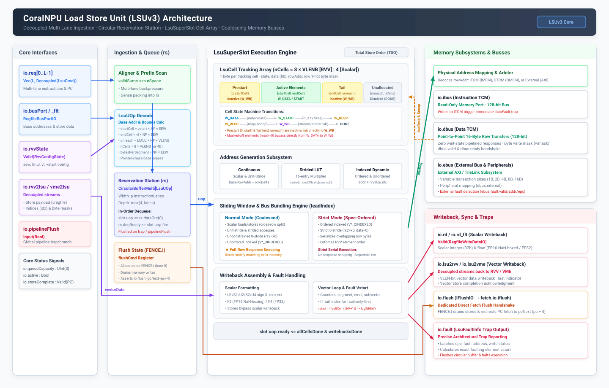
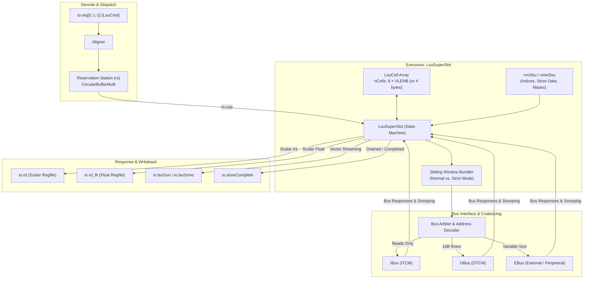

# Load Store Unit (LSUv3)



The Load Store Unit (LSU) executes memory operations for scalar, floating-point, vector (RVV), and matrix/tile (VME) instructions. It translates decoded operations into memory transactions across tightly-coupled memories (TCM) and external system busses while managing coalescing, ordering, fault reporting, and register writeback.



## Pipeline Overview

The LSU operates as a decoupled, in-order execution pipeline:

1. **Ingestion & Pointer-Chasing (`LsuUOp`)**: Decodes up to `p.instructionLanes` commands (`LsuCmd`) per cycle, fetching base addresses and store data from the scalar/floating-point register file bus ports (`io.busPort`, `io.busPort_flt`).
2. **Reservation Station (`rs`)**: Dispatched micro-operations are packed by an `Aligner` and stored in a multi-lane circular buffer (`CircularBufferMulti`) to buffer commands ahead of execution.
3. **Execution Engine (`LsuSuperSlot`)**: Dequeues a single `LsuUOp` at a time and instantiates an array of byte-level tracking cells (`LsuCell`) sized to the maximum architectural vector register group ($8 \times \text{VLENB}$, or 4 bytes for scalar configurations).
4. **Windowed Bus Bundling**: Scans active cells using a sliding window (`windowSizeNormal` or `windowSizeStrict`), bundling matching row addresses into coalesced 16-byte (`p.lsuDataBytes`) memory transactions.
5. **Writeback & Streaming**: Routes read responses back into cells (with single-cycle response snooping across identical rows) and streams completed elements to scalar writeback ports or the vector core (`io.lsu2rvv`).

## Ingestion & Reservation Station (`rs`)

### Multi-Lane Ingestion & Alignment

The core dispatch unit presents up to `p.instructionLanes` decoupled memory commands (`io.req`) per cycle.

- **Capacity Check**: A prefix-sum scan (`validSums`) checks against `rs.io.nSpace` to determine how many commands can be accepted. Remaining lanes are backpressured (`req(i).ready = false`).
- **Operand Fetch**: Base register address generation and store data bypassing occur in parallel using `RegfileBusPortIO`.
- **`LsuUOp` Generation**: Computes initial byte-level memory bounds (prestart `startCell = vstart × NF × EEW`, active elements `[startCell, endCell)` with `endCell = vl × NF × EEW`, and unreachable tail bounds `[endCell, unreachableCell)` with `unreachableCell = LMUL × NF × VLENB`), stride multipliers (`bytesPerSegment`), and vector addressing modes from `io.rvvState` (`vtype`, `vl`, `vstart`).
- **Alignment**: The `Aligner` packs sparse valid dispatches into dense circular buffer inputs.

### Circular Buffer (`CircularBufferMulti`)

The reservation station buffers up to `max(4, p.instructionLanes)` micro-operations.

- It exposes current queue occupancy via `io.queueCapacity`.
- Flushed synchronously when `io.pipelineFlush` asserts or on an unrecoverable memory fault.

## `LsuSuperSlot` & `LsuCell` Array

`LsuSuperSlot` coordinates all memory bus transactions, RVV handshakes, and register writebacks for the actively executing instruction.

### The `LsuCell` Array

Execution is partitioned across `nCells` byte cells ($8 \times \text{VLENB}$ with RVV enabled, or 4 for scalar-only):

```text
Cell Index:  [ 0 ... startCell )  |  [ startCell ... endCell )  |  [ endCell ... unreach )  |  [ unreach ... nCells )
             |< Prestart (Inactive) >|<    Active Elements     >|<     Tail (Inactive)    >|<  Unallocated (DONE)  >|
             [0, startCell)           [startCell, endCell)       [endCell, unreach)          [unreach, nCells)
```

Each `LsuCell` stores:

- `state`: Current lifecycle state (`LsuCellState`).
- `data`: 8-bit data payload.
- `rowAddr`: Memory row address (`addr >> dbusOffsetBits`).
- `mask`: One-hot byte position within the 16-byte bus row.

### Cell Lifecycle (`LsuCellState`)

- **`DONE`**: Cell is idle, unallocated (`[unreachableCell, nCells)`), or has finished writeback.
- **`W_DATA`**: Waiting for vector element index (`rvv2lsu.idx`), store data (`rvv2lsu.vregfile`), or mask bit (`rvv2lsu.mask`). Masked-off elements (`mask == 0`) transition directly to `W_WB`.
- **`W_START`**: Address and store data are valid; ready to participate in a bus transaction.
- **`W_RESP`**: Bus request issued; awaiting bus response data.
- **`W_WB`**: Data returned from memory (or skipped); awaiting scalar writeback or vector writeback stream acknowledgment. Inactive elements (both prestart elements `[0, startCell)` and tail elements `[endCell, unreachableCell)`) initialize directly to `W_WB` (or `DONE` for tile stores), skipping memory transactions.

### Address Generation Paths

1. **Continuous (Scalar & Unit-Stride Vector)**: Base row address and byte offsets are pre-computed using a consecutive row lookup table (`rowTable`), allowing immediate parallel initialization of all cell row addresses.
2. **Strided (RVV)**: Uses a 16-entry lookup table (`makeStridedOffsets`) for supported element/segment multipliers ($1, 2, \dots, 32$) scaled by stride ($rs2$).
3. **Indexed (RVV)**: Base address is updated dynamically per element as index vectors arrive over `rvv2lsu.idx`.

## Bus Transaction Bundling & Memory Modes

CoralNPU bus transactions are aligned to 16-byte rows (`p.lsuDataBytes`). `LsuSuperSlot` maintains a sliding window of cells starting at `leadIndex`:

### Normal Mode (Coalesced & Snooped)

- Examines up to `windowSizeNormal` (16) cells ahead of `leadIndex`.
- Coalesces all cells targeting the same `rowAddr` into a single bus transaction with an aggregated byte mask (`wmask`) and write data (`wdata`).
- Services all standard memory operations not requiring strict element serialization:
  - Scalar integer and floating-point loads/stores.
  - Unit-stride vector loads/stores (including masked and whole-register variants).
  - Unordered indexed vector operations (`VLOAD_UINDEXED`, `VSTORE_UINDEXED`).
  - Non-zero strided vector operations (`VLOAD_STRIDED`, `VSTORE_STRIDED`).
  - Unconstrained zero-stride vector operations where `rs2 == x0`. Per the RISC-V Vector specification, strided instructions encoding `rs2 == x0` permit combining multiple elements into fewer memory accesses.
  - Matrix/tile operations (`VTLOAD`, `VTSTORE` under VME).
- **Response Snooping**: On read responses, all cells in the slot matching `respRowAddr` in states `W_START` or `W_RESP` capture data in parallel, drastically reducing bus bandwidth for duplicate or clustered accesses.

### Strict Mode (Spec-Ordered Execution)

- Engaged exclusively for operations requiring strict element-ordered execution:
  - Ordered indexed vector operations (`VLOAD_OINDEXED`, `VSTORE_OINDEXED`).
  - Constrained zero-stride vector operations where a non-zero register holds zero (`rs2 != x0` and `Reg[rs2] == 0`). While `rs2 == x0` permits coalescing in Normal Mode, the RVV specification mandates that non-`x0` registers with value zero must preserve element order without combining accesses.
- Enforces strict serial memory ordering within the active window (`windowSizeStrict`) as required by the RISC-V Vector specification, ensuring earlier vector elements perform their bus transactions before later elements in the same row rather than being coalesced.

### Scalar Cross-Row Accesses

Scalar memory accesses execute through Normal Mode. If a scalar load or store crosses a 16-byte row boundary, it is split into at most two naturally aligned power-of-two bus transfers (`tx1Size` and `tx2Size`) precomputed during instruction initialization (`computeScalarTxPlan`):

- `tx1`: Naturally aligned transfer for residual bytes in row 1 ending at the row boundary (or the entire access if within a single row).
- `tx2`: Naturally aligned transfer for remaining bytes in row 2 starting at offset 0.

## Subsystem Busses

The LSU routes memory transactions to three distinct destinations based on physical address mapping:

| Subsystem | Port | Access Type | Description |
| :--- | :--- | :--- | :--- |
| **Instruction TCM** | `io.ibus` | Read-only | Instruction TCM accesses. Writes to ITCM are trapped as faults (`ibusFault`). |
| **Data TCM** | `io.dbus` | Read / Write | Point-to-point 16-byte fixed-size interface to DTCM. Zero wait-state pipelined responses. |
| **External Memory** | `io.ebus` | Read / Write | External memory / peripheral transactions (AXI/TileLink). Supports sub-row transaction sizes and external bus fault reporting (`ebus.fault`). |

## Pipeline Synchronization & Fault Handling

### `FENCE` & Total Store Order

CoralNPU guarantees total memory order across all execution lanes in hardware. Standard `FENCE` instructions are recognized as NOPs at dispatch and retire immediately without stalling the pipeline.

### `FENCE.I` (Instruction Cache / Fetch Sync)

- Recognized on lane 0 (`LsuOp.FENCEI`).
- Allocates `FlushCmd` with `pcNext = pc + 4`.
- Awaits complete drainage of all in-flight store transactions in `LsuSuperSlot`.
- Directly pulses `io.flush` (`IFlushIO`) to instruction fetch (`fetch.io.iflush`), redirecting fetch to `pcNext`.

### Fault Reporting

Memory faults (DTCM access violation, ITCM write violation, or external bus slave errors) trigger precise architectural traps:

- Further transaction dispatch is frozen.
- `rs` is flushed (`rs.io.flush`).
- For vector operations, `faultingVstart` calculates the exact failing element index:
  $$\text{vstart} = \frac{\text{faultingCell}}{\text{NF} + 1} \gg \log_2(\text{elementBytes})$$
- Latches precise fault info on `io.fault` (`valid`, `epc`, `addr`, `write`, `vstart`).

## Interface Reference

### Core & Dispatch Interfaces

| Signal | Direction | Type | Description |
| :--- | :--- | :--- | :--- |
| `io.req[L]` | Input | `Vec(L, Decoupled(LsuCmd))` | Incoming instruction commands across $L$ dispatch lanes. |
| `io.busPort` | Input | `RegfileBusPortIO` | Integer register file read port for base addresses and store data. |
| `io.busPort_flt` | Input | `RegfileBusPortIO` | Floating-point register file read port for store data (optional). |
| `io.queueCapacity`| Output | `UInt(3.W)` | Available capacity in the circular reservation station. |
| `io.pipelineFlush`| Input | `Bool` | Global pipeline flush signal from branch/trap unit. |
| `io.active` | Output | `Bool` | High if LSU has queued or executing instructions. |
| `io.storeComplete`| Output | `Valid(UInt(32.W))` | Pulses with PC when a store instruction fully commits. |

### Memory Bus Interfaces

| Port | Signals | Description |
| :--- | :--- | :--- |
| `io.ibus` | `valid`, `ready`, `addr`, `rdata` | Read-only access to ITCM memory. |
| `io.dbus` | `valid`, `ready`, `write`, `addr`, `adrx`, `size`, `pc`, `wdata`, `wmask`, `rdata` | Point-to-point interface to DTCM (16-byte transfers). |
| `io.ebus` | `dbus` (same as above), `fault`, `internal` | Interface to external bus bridge / peripherals with fault detection. |
| `io.flush` | `valid`, `ready`, `pcNext` | Flush handshake (`IFlushIO`) wired to `fetch.io.iflush`. |
| `io.fault` | `valid`, `bits` (`LsuFaultInfo`) | Precise trap info: faulting PC, address, write flag, and vector `vstart`. |

### Writeback & Extension Interfaces

| Port | Direction | Type | Description |
| :--- | :--- | :--- | :--- |
| `io.rd` | Output | `Valid(RegfileWriteDataIO)` | Integer scalar register file writeback. |
| `io.rd_flt` | Output | `Valid(FloatRegfileWriteDataIO)` | Floating-point scalar register file writeback. |
| `io.rvv2lsu[2]` | Input | `Vec(2, Decoupled(Rvv2Lsu))` | Vector core streams: vector store data, index vectors, and masks. |
| `io.lsu2rvv[2]` | Output | `Vec(2, Decoupled(Lsu2Rvv))` | Vector writeback data stream and store completion acknowledgments. |
| `io.rvvState` | Input | `Valid(RvvConfigState)` | Dynamic RVV architectural state (`sew`, `lmul`, `vl`, `vstart`). |
| `io.vme2lsu` / `io.lsu2vme` | I/O | `Decoupled` | Streaming interface for matrix/tile operations (VME). |
