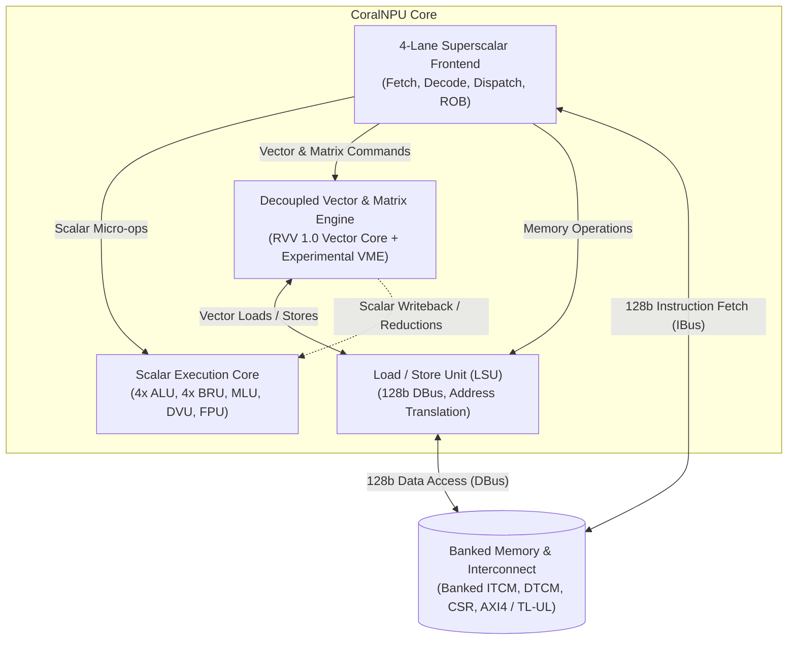
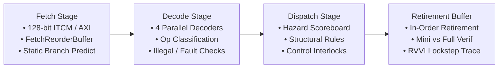
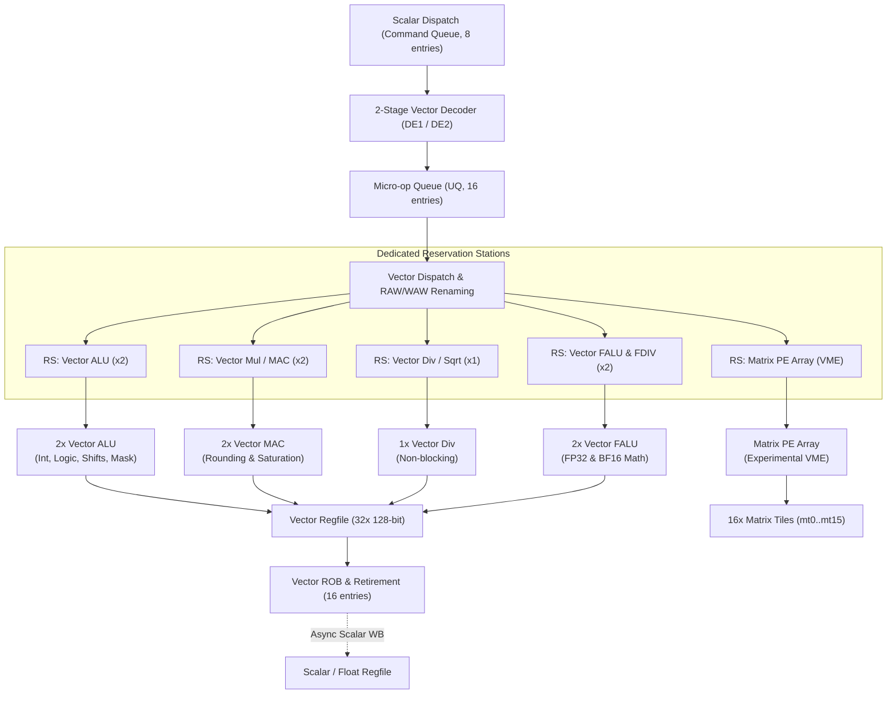
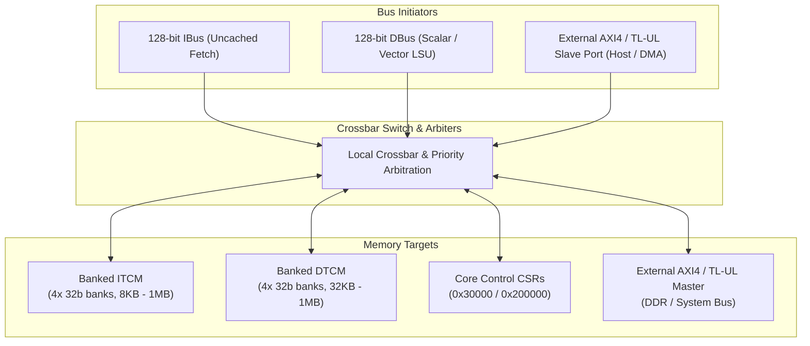

# CoralNPU Overview

**CoralNPU** is a high-performance, modular, 4-lane superscalar RISC-V processor designed for edge machine learning (ML), digital signal processing (DSP), and embedded control workloads.

Built using a hybrid Chisel and SystemVerilog architecture, CoralNPU pairs an in-order, 4-wide dispatch scalar core with standard RISC-V extensions, an IEEE-754 floating-point unit, a decoupled RISC-V Vector (RVV 1.0) execution backend, and an experimental, optional implementation of the Vector Matrix Extension (VME / Zvt).

---

## Architecture Block Diagram

The CoralNPU processor separates instruction fetch/dispatch, scalar execution, decoupled vector/matrix acceleration, and banked memory into modular subsystems:



---

## Core Variants

CoralNPU is structured into three primary production configurations, ranging from a lightweight scalar+floating-point core to a full vector-matrix machine learning accelerator:

| Feature / Metric | `CoreMini` | `RvvCoreMini` | `VmeCoreMini` |
| :--- | :--- | :--- | :--- |
| **ISA Base & Extensions** | RV32IMF_Zba_Zbb_Zicsr_Zifencei_Zfbfmin | RV32IMF_Zba_Zbb_Zicsr_Zifencei_Zfbfmin + RVV 1.0 (`Zve32x`, `Zve32f`, `Zvfbfmin`) | RV32IMF_Zba_Zbb_Zicsr_Zifencei_Zfbfmin + RVV 1.0 + Experimental VME / Zvt Extension |
| **Scalar Frontend** | 4-lane superscalar (in-order fetch, decode, dispatch) | 4-lane superscalar (in-order fetch, decode, dispatch) | 4-lane superscalar (in-order fetch, decode, dispatch) |
| **Scalar Regfiles** | 32x 32-bit integer (`x0`..`x31`), 32x 32-bit float (`f0`..`f31`) | 32x 32-bit integer (`x0`..`x31`), 32x 32-bit float (`f0`..`f31`) | 32x 32-bit integer (`x0`..`x31`), 32x 32-bit float (`f0`..`f31`) |
| **Vector Engine (RVV)** | *None* | Decoupled SV RVV backend (`VLEN=128`, 32x `v0`..`v31`, out-of-order execution, ROB) | Decoupled SV RVV backend (`VLEN=128`, 32x `v0`..`v31`, out-of-order execution, ROB) |
| **Matrix Engine (VME)** | *None* | *None* | Experimental Matrix PE Array, 16 Matrix Tile registers (`mt0`..`mt15`), INT8/FP32/BF16 GEMM |
| **Vector/Matrix Execution Units** | *None* | 2x VALU, 2x VMUL/MAC, 1x VDIV, 2x VFALU, 1x VFDIV, 1x VReduction/Permute | 2x VALU, 2x VMUL/MAC, 1x VDIV, 2x VFALU, 1x VFDIV, 1x VReduction/Permute, Parallel Matrix PE Array |
| **Instruction Fetch** | 128-bit Uncached Fetch (`FetchReorderBuffer` + `InstructionBuffer`) | 128-bit Uncached Fetch (`FetchReorderBuffer` + `InstructionBuffer`) | 128-bit Uncached Fetch (`FetchReorderBuffer` + `InstructionBuffer`) |
| **LSU Bus Width** | 128-bit DBus (scalar + float) | 128-bit DBus (scalar, float, unit/strided/indexed vector loads/stores) | 128-bit DBus (scalar, float, vector, matrix tile load/store) |
| **TCM Sizing Options** | Default (8KB ITCM / 32KB DTCM) or Highmem (up to 1MB/1MB) | Default (8KB ITCM / 32KB DTCM) or Highmem (up to 1MB/1MB) | Default (8KB ITCM / 32KB DTCM) or Highmem (up to 1MB/1MB) |
| **System Interconnect** | AXI4 (`CoreMiniAxi`) or TileLink-UL (`CoreMiniTlul`) | AXI4 (`RvvCoreMiniAxi`) or TileLink-UL (`RvvCoreMiniTlul`) | AXI4 (`VmeCoreMiniAxi`) or TileLink-UL |
| **Target Application** | Control plane, scalar math, lightweight DSP & FP32/BF16 routines | SIMD DSP, computer vision, vector math, audio processing | High-throughput ML inference, CNNs, GEMM, Transformer attention layers |

---

### 1. `CoreMini` (Scalar + Floating-Point Core)

`CoreMini` provides a compact, energy-efficient 32-bit RISC-V CPU core capable of 4-wide superscalar instruction issue:

- **Integer Core (RV32I / M / Zba / Zbb)**: Full standard integer support with 4 ALUs, 4 branch resolution units, a 2-cycle pipelined multiplier (MLU), a multi-cycle integer divider (DVU), and full bit manipulation extensions (rotates, counts, shifts, min/max).
- **Scalar Floating-Point (RV32F + Zfbfmin)**: Integrated IEEE-754 single-precision FPU (`FloatCore`) with support for FP32 arithmetic (`fadd`, `fsub`, `fmul`, `fmadd`, `fdiv`, `fsqrt`, comparisons, conversions) and Bfloat16 conversions (`fcvt.bf16.s`, `fcvt.s.bf16`).
- **Scoreboard & Hazard Control**: Full register scoreboarding preventing RAW/WAW hazards across multi-cycle operations (MLU, DVU, LSU, FPU).
- **Uncached Fetch**: 128-bit wide fetch engine with out-of-order bus response handling via `FetchReorderBuffer`.

### 2. `RvvCoreMini` (Scalar + FPU + RVV 1.0 Vector Backend)

`RvvCoreMini` adds a standard RISC-V Vector Extension 1.0 (RVV 1.0) backend to `CoreMini`:

- **Vector Parameters**: `VLEN = 128` bits (16 bytes per vector register), 32 vector registers (`v0`..`v31`), supporting SEW = 8, 16, 32 bits and LMUL = 1/8, 1/4, 1/2, 1, 2, 4, 8.
- **Decoupled SystemVerilog Backend**: The scalar frontend dispatches vector commands into an 8-entry Command Queue (CQ). A 2-stage vector decoder expands vector instructions into micro-ops (`uops`) placed in a 16-entry Uop Queue.
- **Out-of-Order Vector Execution**: Micro-ops are dispatched across dedicated Reservation Stations into multi-lane vector functional units:
  - **2x Vector ALUs**: Logical, arithmetic, shift, mask operations, and vector population count / index operations (`viota.m`, `vid.v`).
  - **2x Vector Multipliers / MACs**: Integer multiplication, fused multiply-accumulate, fixed-point rounding (`vxrm`), and saturation (`vxsat`).
  - **1x Vector Integer Divider**: Multi-cycle integer division and remainder operations.
  - **2x Vector FALUs & 1x Vector FDIV**: Single-precision FP32 vector math (`vfadd`, `vfsub`, `vfmul`, `vfmacc`, `vfdiv`, `vfsqrt`) and Bfloat16 vector instructions (`vfwmaccbf16.vv`, `vfwcvtbf16`, `vfncvtbf16`).
  - **1x Vector Permutation & Reduction Unit**: Gather/scatter register slides, compress, integer reductions (`vredsum`, `vredmax`, etc.), and FP reductions.
- **Vector Reorder Buffer (ROB)**: 16-entry vector ROB guarantees precise exceptions, in-order retirement, and asynchronous writeback to scalar and floating-point register files (`vfmv.f.s`, reductions, `vsetvl`).
- **Vector Memory Access**: Full support in LSU for unit-stride, strided, ordered/unordered indexed (gather/scatter), mask, and fault-only-first (`vle8ff.v`) memory operations.

### 3. `VmeCoreMini` (Scalar + FPU + RVV + Experimental VME Accelerator)

`VmeCoreMini` extends `RvvCoreMini` with an experimental, optional implementation of the Vector Matrix Extension (VME / Zvt) for exploring high-density matrix compute:

- **Matrix Tile State (MT)**: 16 matrix tile registers (`mt0`..`mt15`) mapped across 4 sub-tile blocks with 16-byte subtiles.
- **Matrix Configuration**: Dedicated matrix configuration CSRs and instructions (`mtype`, `msetmtype`, `msetmtypei`, `msettn`, `msettm`, `msettk`) configuring matrix dimensions ($M, N, K$) and data types.
- **Parallel Processing Element (PE) Array**: High-throughput compute blocks executing outer-product and matrix multiply-accumulate (GEMM) workloads across INT8, FP32, and BF16 formats.
- **Matrix Accumulation & Transpose**: Hardware matrix accumulator (`zvt_acc`) and hardware matrix transpose units (`zvt_mt`) for spatial layout alignment.
- **High-Bandwidth Matrix Load/Store**: Direct coupling between the VME unit and the LSU (`mload`, `mstore`) allowing direct 2D matrix tile streaming to and from DTCM.

---

## Microarchitecture Deep-Dive

### 1. 4-Lane Superscalar Frontend

The CoralNPU scalar frontend fetches, decodes, and dispatches up to 4 instructions per cycle:



### 2. Functional Unit Execution Latencies

| Execution Unit | Pipeline Latency | Max Issue Rate | Operations Serviced |
| :--- | :--- | :--- | :--- |
| **Integer ALU (x4)** | 1 cycle | 4 / cycle | Add, sub, logic, shifts, compares, Zba/Zbb bitops |
| **Branch Unit (x4)** | 1 cycle | 4 / cycle | `beq`, `bne`, `blt`, `bge`, `jal`, `jalr`, `mret` |
| **Multiplier (MLU)** | 2 cycles | 1 / cycle | `mul`, `mulh`, `mulhu`, `mulhsu` |
| **Divider (DVU)** | Multi-cycle (blocking) | 1 / multi-cycle | `div`, `divu`, `rem`, `remu` |
| **FloatCore (FPU)** | Multi-cycle pipelined | 1 / cycle | IEEE-754 FP32 add/sub/mul/fma/div/sqrt/cmp, BF16 cvt |
| **Load/Store Unit (LSU)**| 2+ cycles | 1 / cycle | Scalar, float, vector, and matrix memory accesses |
| **RVV Vector Backend** | Multi-cycle decoupled | Up to 2 cmds / cycle | Vector arithmetic, MAC, FALU, permute, reductions |
| **Zvt Matrix Engine (Experimental)** | Multi-cycle | Block pipelined | Matrix multiplication, transpose, tile load/store |

### 3. Decoupled Vector & Matrix Pipeline

The decoupled vector backend executes micro-ops out-of-order across parallel reservation stations:



---

## Memory Architecture & Subsystem

CoralNPU provides a flexible memory architecture optimized for low-latency scratchpad accesses and high-bandwidth streaming:



### 1. Tightly-Coupled Memories (TCM)

- **Instruction TCM (ITCM)**: Banked single-cycle SRAM storing instructions.
- **Data TCM (DTCM)**: Multi-banked SRAM array with local crossbar (`BankedDtcm.scala`) supporting concurrent accesses by the scalar LSU, vector memory unit, matrix engine, and external DMA/host port without bank conflicts.
- **Configurable Sizing**:
  - **Default**: 8 KB ITCM, 32 KB DTCM.
  - **Highmem Configurations**: Up to 1024 KB ITCM and 1024 KB DTCM (or 512KB/512KB).

### 2. Bus Interfaces & Crossbars

- **AXI4 Master Port (`axi_master`)**: 128-bit AXI4 master interface used by the LSU for external memory transactions (DDR, SRAM, memory-mapped peripherals) and by the instruction fetcher as a fallback when PC is outside ITCM.
- **AXI4 Slave Port (`axi_slave`)**: 128-bit AXI4 slave interface enabling host processors or system DMA controllers to read/write ITCM, DTCM, and core CSRs directly.
- **TileLink (TL-UL)**: Native TileLink Uncached-Lite variants (`CoreTlul`, `CoralNPUChiselSubsystem`) for OpenTitan and TileLink-based SoC fabrics.

### 3. Integrated Peripherals & Control

- **DMA Controller (`DmaEngine.scala`)**: Multi-channel 2D/1D DMA engine for high-speed background data transfers between external memory and TCMs.
- **Interrupt Controllers**: Platform-Level Interrupt Controller (PLIC) and Core Local Interruptor (CLINT) for timer and software interrupts.
- **Debug Module (DM)**: RISC-V standard debug unit supporting single-step execution, hardware breakpoints, register inspection, and GDB integration.
- **Power & Clock Management**: Hardware clock gating (`ClockGate`) on WFI / idle and asynchronous reset synchronizers (`RstSync`).

---

## Memory Map

### Default Memory Layout

| Region | Start Address | Size | Access Type | Description |
| :--- | :--- | :--- | :--- | :--- |
| **ITCM** | `0x0000_0000` | 8 KB (`0x0000_2000`) | R/X | Primary Instruction TCM |
| **DTCM** | `0x0001_0000` | 32 KB (`0x0000_8000`) | R/W | Multi-Banked Data TCM |
| **CSR / Peripheral** | `0x0003_0000` | 4 KB (`0x0000_1000`) | R/W | Memory-Mapped Control Registers |
| **External Memory** | *Outside TCM* | Variable | R/W/X | System AXI/TL-UL bus space (DDR, peripherals) |

### Highmem Memory Layout

| Region | Start Address | Max Size | Access Type | Description |
| :--- | :--- | :--- | :--- | :--- |
| **ITCM** | `0x0000_0000` | Up to 1 MB | R/X | Highmem Instruction TCM |
| **DTCM** | `0x0010_0000` | Up to 1 MB | R/W | Highmem Data TCM |
| **CSR / Peripheral** | `0x0020_0000` | 4 KB | R/W | Memory-Mapped Control Registers |
| **External Memory** | *Outside TCM* | Variable | R/W/X | System AXI/TL-UL bus space |

---

## Build Targets & Output Artifacts

CoralNPU provides direct `.zip` (multi-file package with topological `filelist.f`) and `.sv` (monolithic SystemVerilog) build targets:

```bash
# --- CoreMini (Scalar + FPU AXI) ---
# Multi-file SystemVerilog package with filelist.f
bazel build //hdl/chisel/src/coralnpu:CoreMiniAxi.zip
# Monolithic single-file SystemVerilog
bazel build //hdl/chisel/src/coralnpu:CoreMiniAxi.sv

# --- RvvCoreMini (Scalar + FPU + RVV 1.0 AXI) ---
# Multi-file SystemVerilog package with filelist.f
bazel build //hdl/chisel/src/coralnpu:RvvCoreMiniAxi.zip
# Monolithic single-file SystemVerilog
bazel build //hdl/chisel/src/coralnpu:RvvCoreMiniAxi.sv

# --- VmeCoreMini (Scalar + FPU + RVV + Matrix AXI) ---
# Multi-file SystemVerilog package with filelist.f
bazel build //hdl/chisel/src/coralnpu:VmeCoreMiniAxi.zip
# Monolithic single-file SystemVerilog
bazel build //hdl/chisel/src/coralnpu:VmeCoreMiniAxi.sv
```

---

## Verilator Simulation

CoralNPU provides cycle-accurate SystemC/Verilator simulators for running, validating, and debugging compiled RISC-V ELF executables.

### 1. Simulator Variants and Verification Flavors

Simulators are parameterized by core architecture, memory size, and verification support:

| Simulator Target | Core Architecture | Memory Configuration | Verification / Full ROB |
|:---|:---|:---|:---:|
| `//tests/verilator_sim:core_mini_axi_sim` | CoreMini (Scalar + FPU) | Default (8 KB ITCM / 32 KB DTCM) | No (`mini` ROB) |
| `//tests/verilator_sim:core_mini_verification_axi_sim` | CoreMini (Scalar + FPU) | Default (8 KB ITCM / 32 KB DTCM) | **Yes** (Full ROB) |
| `//tests/verilator_sim:core_mini_highmem_axi_sim` | CoreMini (Scalar + FPU) | Highmem (1 MB ITCM / 1 MB DTCM) | No (`mini` ROB) |
| `//tests/verilator_sim:rvv_core_mini_axi_sim` | RvvCoreMini (Scalar + FPU + RVV 1.0) | Default (8 KB ITCM / 32 KB DTCM) | No (`mini` ROB) |
| `//tests/verilator_sim:rvv_core_mini_verification_axi_sim` | RvvCoreMini (Scalar + FPU + RVV 1.0) | Default (8 KB ITCM / 32 KB DTCM) | **Yes** (Full ROB) |
| `//tests/verilator_sim:rvv_core_mini_highmem_axi_sim` | RvvCoreMini (Scalar + FPU + RVV 1.0) | Highmem (1 MB ITCM / 1 MB DTCM) | No (`mini` ROB) |

#### Instruction Tracing Requires Verification Simulators

In production and non-verification builds (`core_mini_axi_sim`, `rvv_core_mini_axi_sim`), the Retirement Buffer (ROB) operates in `mini` mode (`enableVerification = false`). To minimize hardware area during synthesis, `mini` mode zeroes out instruction word storage (`inst = UInt(0.W)`). As a result, running `--instr_trace` on standard simulator builds prints `0x00000000` for instruction opcodes.

For accurate instruction disassembly and trace logs with `--instr_trace`, you **must** build and run the verification simulator flavor (`core_mini_verification_axi_sim` or `rvv_core_mini_verification_axi_sim`).

### 2. Simulator Command-Line Flags

| Flag | Default | Description |
|:---|:---|:---|
| `--binary=<path>` | `""` (required) | Absolute or relative path to the RISC-V ELF executable to run. |
| `--backdoor_load` | `false` | When `false` (default), the testbench loads the ELF byte-by-byte through simulated frontdoor AXI bus transactions, which is slow. Set `--backdoor_load` (or `--backdoor_load=true`) to load binary segments directly into simulated SRAM via DPI backdoor at time zero. |
| `--instr_trace` | `false` | Logs retired instructions (PC, instruction word, destination register, writeback data) to console. Requires a verification simulator flavor. |
| `--trace` | `false` | Dumps a VCD/FST waveform trace for debugging in waveform viewers (e.g. GTKWave, Surfer). |
| `--debug_axi` | `false` | Enables verbose debug logging of AXI bus transactions across TLM-to-AXI bridges. |
| `--cycles=<N>` | `100000000` | Maximum simulation cycle budget before aborting with timeout. |

### 3. Toolchain Transition & Locating Target ELFs

When building both the simulator (a host executable) and the target RISC-V software in Bazel, keep in mind that target ELFs undergo a platform transition:

- Host simulator binaries (e.g. `core_mini_axi_sim`) are built for the host architecture and placed under the standard `bazel-bin/` symlink (e.g. `bazel-bin/tests/verilator_sim/core_mini_axi_sim`).
- Target RISC-V executables built with `coralnpu_v2_binary` (e.g. `//tests/cocotb:math.elf`) undergo a toolchain transition (`_coralnpu_v2_transition` to `//platforms:coralnpu_v2`). Bazel writes transitioned artifacts into a hashed output directory such as `bazel-out/k8-fastbuild-ST-<hash>/bin/...`, which is **not** symlinked into `bazel-bin/`.

Attempting to run `./bazel-bin/.../sim --binary=bazel-bin/tests/cocotb/math.elf` will fail with "No such file or directory".

To locate the actual path of any target ELF, query Bazel using `bazel cquery --output=files`:

```bash
# Query the transitioned output path for a target ELF
bazel cquery --output=files //tests/cocotb:math.elf
# Output: bazel-out/k8-fastbuild-ST-dd8dc713f32d/bin/tests/cocotb/math.elf
```

### 4. Complete End-to-End Workflow Example

The following example builds both the verification simulator and the `math.elf` sample program, then executes the simulation with high-speed backdoor loading and instruction tracing:

```bash
# 1. Build the verification simulator and target ELF
bazel build //tests/verilator_sim:core_mini_verification_axi_sim //tests/cocotb:math.elf

# 2. Resolve the transitioned ELF path
TARGET_ELF=$(bazel cquery --output=files //tests/cocotb:math.elf)

# 3. Execute the simulation
./bazel-bin/tests/verilator_sim/core_mini_verification_axi_sim \
  --binary="${TARGET_ELF}" \
  --backdoor_load \
  --instr_trace
```
